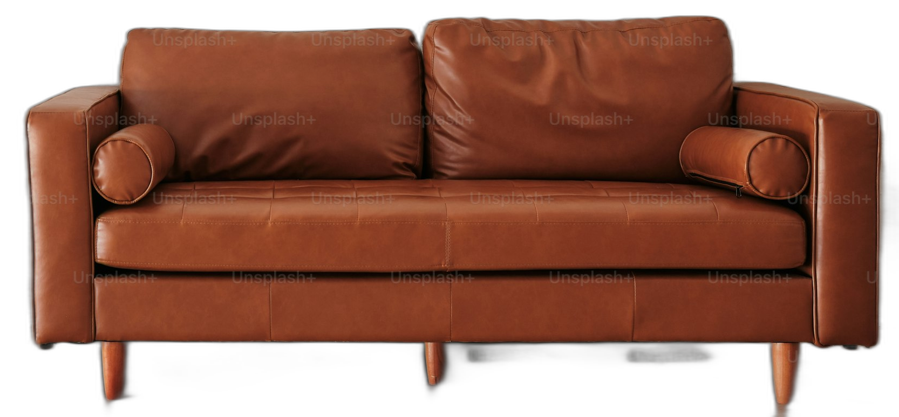
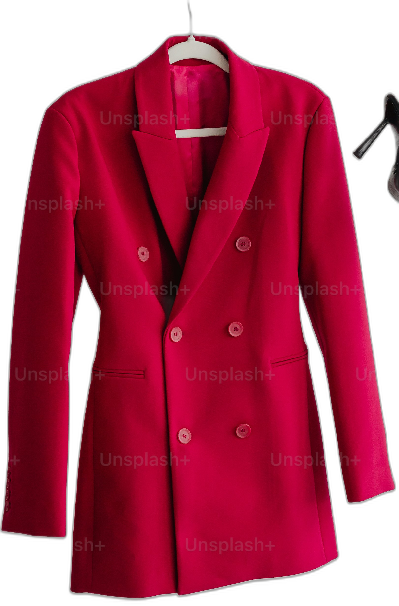
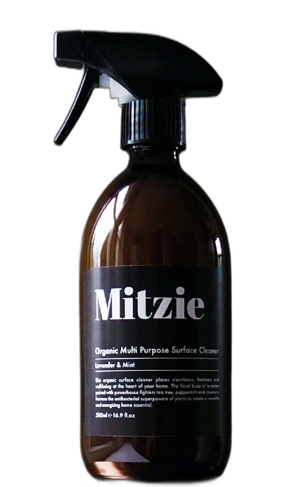

# Interactive Image Background Removal - by Team Victory

Hi,  
This project provides an interactive web-based tool that allows users to remove the background of an image using a bounding box selection. The web application consists of a frontend interface to upload an image and draw a bounding box, and a backend that processes the image, removes the background, and returns the processed image for download.  
Additionally, the project integrates Google Vision for object detection within the bounding box. This functionality can help improve the accuracy of background removal by identifying objects, although it has not yet been deployed. It will be deployed soon in the next update! 😊

Website: [Interactive Image Background Removal](https://flask-app-400049391293.asia-south1.run.app)

## Features

- **Image URL Upload**: Input an image URL to load the image.
- **Bounding Box Selection**: Draw a bounding box over the area of the image to retain.
- **Manual Co-ordinates**: Also you can enter the manual co-ordinates i.e X_min,X_max,Y_min,Y_max. 
- **Background Removal**: Process the image and remove the background using AI-based algorithms.
- **Object Detection with Google Vision**: Detect objects in the selected bounding box (will update soon on the website).
- **Download Processed Image**: Get the processed image with a transparent background and download it.

## Table of Contents

1. [Features](#features)
2. [Technologies Used](#technologies-used)
3. [Setup](#setup)
4. [How It Works](#how-it-works)
5. [Endpoints](#endpoints)
6. [License](#license)

## Technologies Used

- **Frontend**: HTML, CSS, JavaScript
- **Backend**: Python (Flask)
- **Background Removal**: [rembg](https://github.com/danielgatis/rembg)
- **Google Vision API**: For object detection within the bounding box.
- **AI Algorithms**: Used for removing image backgrounds.
- **Image Processing**: Pillow for image manipulation.

## Setup

### Frontend

1. Clone or download the project files from the repository.
2. Open the `Homepage.html` file in a browser to run the frontend application.

### Backend

1. Install the required dependencies:
   
   ```bash
   pip install Flask rembg Pillow requests flask-cors google-cloud-vision
   ```

2. Save the Python backend code in a file, such as `app.py`.
3. Run the Flask app:

   ```bash
   python app.py
   ```

4. The app will be available at [http://localhost:8080](http://localhost:8080).

## How It Works

1. **Load Image**: Input a public image URL into the frontend form to load the image.
2. **Draw Bounding Box**: Use the frontend canvas to draw a bounding box around the area of the image that should remain.
3. **Background Removal**: Once the bounding box is drawn, the backend processes the image, removes the background using the rembg AI model, and generates a transparent background.
4. **Object Detection**: The system will use Google Vision API to detect objects within the bounding box, enhancing background removal accuracy.
5. **Download Processed Image**: The processed image with the removed background is returned, and the user can download the result.

### Example Request

Here’s an example of how to make a request to the `/remove-background` endpoint:

```json
{
  "image_url": "https://example.com/image.jpg",
  "bounding_box": {
    "x_min": 50,
    "y_min": 100,
    "x_max": 300,
    "y_max": 400
  }
}
```

### Example Response:

The response would return a JSON with the base64-encoded image or a URL to download the processed image. For example:

```json
{
  "original_image_url": "<original_image_url>",
  "processed_image_url": "http://example.com/processed_image.png"
}
```

## Endpoints

### `/remove-background`
- **Method**: `POST`
- **Description**: Accepts an image URL and optional bounding box coordinates to remove the background from the specified area of the image.
- **Request Body**: JSON containing the image URL and bounding box coordinates.
- **Response**: The processed image with the background removed.

#### Example:

```json
{
  "image_url": "https://example.com/image.jpg",
  "bounding_box": {
    "x_min": 50,
    "y_min": 100,
    "x_max": 300,
    "y_max": 400
  }
}
```

### `/download/<filename>`
- **Method**: `GET`
- **Description**: Allows the user to download the processed image after background removal.

### `/object-detection`
- **Method**: `GET`
- **Description**: This endpoint will return detected objects within the bounding box selected by the user, using the Google Vision API.

## Screenshot of the Application

Here’s a screenshot showing the interactive background removal in action. This demonstrates how users can upload an image, draw a bounding box, and remove the background.

.png) 

### Theoretical Overview
The image background removal tool uses an AI-powered algorithm to detect the foreground object and remove the background seamlessly. The bounding box allows users to define the area for processing, ensuring more accurate results.


# Example Usage

Below are examples of how to use the provided images and how the processed outputs look after background removal.

## Example 1: Sofa

**Input:**
- **Image URL:**  
  The input image of a sofa is provided via the link below. Use a bounding box to select the area of the sofa to keep and remove the background.

  ```plaintext
  https://plus.unsplash.com/premium_photo-1681449856688-2abd99ab5a73?q=80&w=2940&auto=format&fit=crop&ixlib=rb-4.0.3&ixid=M3wxMjA3fDB8MHxwaG90by1wYWdlfHx8fGVufDB8fHx8fA%3D%3D
  ```

- **Bounding Box:** Draw a bounding box around the sofa in the image. This is the area that will be kept after background removal.

**Output:**
- After processing, the background around the sofa will be removed. Here’s an example of what the processed image would look like:

  


---

## Example 2: Jacket

**Input:**
- **Image URL:**  
  The input image of a jacket is provided via the link below. Use a bounding box to select the jacket and remove the background.

  ```plaintext
  https://plus.unsplash.com/premium_photo-1675186049563-000f7ac02c44?q=80&w=3087&auto=format&fit=crop&ixlib=rb-4.0.3&ixid=M3wxMjA3fDB8MHxwaG90by1wYWdlfHx8fGVufDB8fHx8fA%3D%3D
  ```

- **Bounding Box:** Draw a bounding box around the jacket to specify the region that will remain.

**Output:**
- After processing, the jacket will be retained, and the background will be removed. Here’s the processed image:

  


---

## Example 3: Oil Bottle

**Input:**
- **Image URL:**  
  The input image of an oil bottle is provided via the link below.

  ```plaintext
  https://images.unsplash.com/photo-1549049950-48d5887197a0?q=80&w=2864&auto=format&fit=crop&ixlib=rb-4.0.3&ixid=M3wxMjA3fDB8MHxwaG90by1wYWdlfHx8fGVufDB8fHx8fA%3D%3D
  ```

- **Bounding Box:** Use the bounding box to select the oil bottle for background removal.

**Output:**
- The oil bottle will be separated from the background. The processed result is shown below:



---

## Example 4: Car

**Input:**
- **Image URL:**  
  The input image of a car is provided via the link below.

  ```plaintext
  https://images.unsplash.com/photo-1469285994282-454ceb49e63c?q=80&w=2942&auto=format&fit=crop&ixlib=rb-4.0.3&ixid=M3wxMjA3fDB8MHxwaG90by1wYWdlfHx8fGVufDB8fHx8fA%3D%3D
  ```

- **Bounding Box:** Draw the bounding box to select the car and remove the background.

**Output:**
- After background removal, the image of the car will look like this:

 


---

## Notes:
- In each of the examples above, the **Input** is an image URL, and the **Bounding Box** is used to specify the area that should be retained after the background is removed.
- The **Output** images displayed above are processed and stored in the repository (i.e., `sofa-boundingbox.png`, `jacket.png`, etc.).

---

## File List:
- `sofa-boundingbox.png`: Processed sofa image
- `jacket.png`: Processed jacket image
- `oil-bottle.png`: Processed oil bottle image
- `processed_image (6).png`: Processed car image


## License
This project is licensed under the MIT License - see the [LICENSE](LICENSE) file for details.

## Contributing
Major Contributor : Dev Chhabada


Feel free to fork this project and submit pull requests! If you'd like to contribute, please follow these steps:

1. Fork the repository.
2. Create a new branch (`git checkout -b feature-branch`).
3. Commit your changes (`git commit -am 'Add new feature'`).
4. Push to the branch (`git push origin feature-branch`).
5. Create a new pull request.

